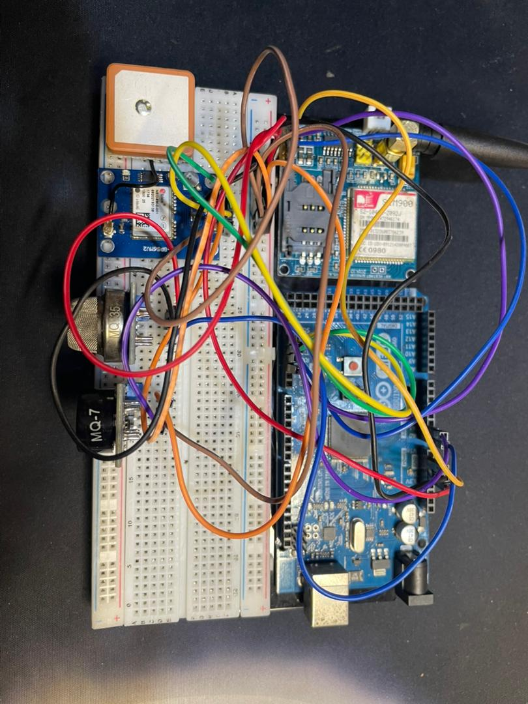
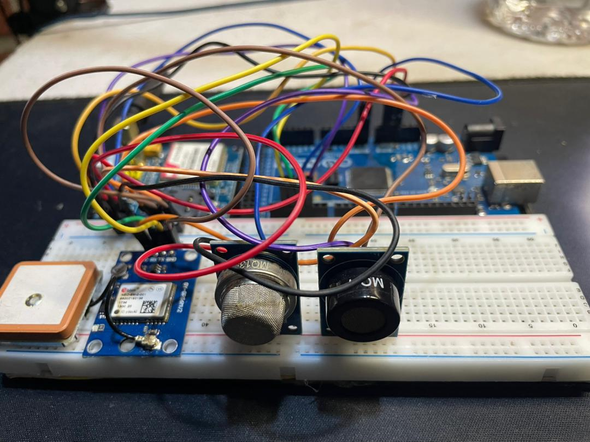

```{r setup}
library(tidyverse)
library(ggplot2)
library(knitr)

df <- read.csv("data/airscan_data_r.csv", stringsAsFactors = FALSE)

couleur_aqi <- function(aqi) {
  case_when(
    aqi < 20 ~ "#22c55e",
    aqi < 40 ~ "#f59e0b",
    aqi < 60 ~ "#ef4444",
    TRUE     ~ "#9d174d"
  )
}

zones_labels <- c(
  Parking_Entree = "Parking Entrée",
  Restaurant_U   = "Restaurant U.",
  Amphi_Central  = "Amphithéâtres",
  Cites_Univ     = "Cités Univ.",
  Zone_Verte     = "Zone Verte"
)
```

---

::: {.hero}
# AirScan CI
**Surveillance intelligente de la qualité de l'air — Campus UFHB Cocody · Abidjan · 2026**
:::

---

# Problématique

L'**Université Félix Houphouët-Boigny (UFHB)** de Cocody accueille chaque jour plus de **65 000 étudiants** sur un campus de **200 hectares** en plein cœur d'Abidjan. Si l'université offre un cadre académique de premier plan, la question de la **qualité de l'air** que respirent étudiants, enseignants et personnels reste largement ignorée.

Pourtant, les sources de pollution y sont multiples et quotidiennes :

- **Trafic automobile** intense aux heures de pointe au niveau du parking d'entrée
- **Émissions de cuisson** au Restaurant Universitaire (charbon, gaz)
- **Accumulation de CO₂** dans les amphithéâtres bondés lors des cours
- **Déchets organiques** dans les cités universitaires

Ces polluants — monoxyde de carbone (CO), dioxyde de carbone (CO₂) et ammoniac (NH₃) — ont des effets documentés sur la santé : fatigue, maux de tête, baisse de concentration, et à long terme, risques respiratoires chroniques.

::: {.callout-custom}
**Aucun système de surveillance de la qualité de l'air n'existait sur le campus de l'UFHB avant ce projet.**
:::

**AirScan CI** répond à ce vide en déployant une balise de mesure autonome sur le campus, collectant des données en temps réel, et en les rendant accessibles à tous via un tableau de bord interactif.

---

# Le système AirScan

## Architecture générale

Le système repose sur un pipeline en quatre étapes :

```
Balise physique  →  Réseau GPRS (SIM900)  →  Serveur  →  Dashboard Shiny
     ↓                                            ↓
 Capteurs MQ                              API Open-Meteo
 GPS · BMP180                          (Température · Humidité)
```

## La balise de mesure

La balise a été **entièrement conçue et assemblée par l'équipe**. Elle est constituée des composants suivants :

| Composant | Rôle |
|-----------|------|
| **Arduino Mega 2560** | Cerveau — orchestre tous les capteurs |
| **MQ-135** | Mesure CO₂ et NH₃ |
| **MQ-7** | Mesure CO (monoxyde de carbone) |
| **BMP180 (GY-68)** | Pression atmosphérique et altitude |
| **GPS NEO-6M** | Géolocalisation de chaque mesure |
| **Module SIM900** | Transmission des données via GPRS |
| **Power bank** | Alimentation autonome sur le terrain |

::: {layout-ncol=2}
{fig-alt="Balise AirScan vue du dessus"}

{fig-alt="Capteurs de la balise"}
:::

> La température et l'humidité ne sont pas mesurées directement par la balise. Le serveur utilise les coordonnées GPS transmises par le module NEO-6M pour interroger l'**API Open-Meteo** et obtenir ces données météorologiques en temps réel.

## Zones instrumentées

Cinq zones du campus ont été identifiées et instrumentées :

```{r carte-zones}
zones_stat <- df %>%
  group_by(zone_campus) %>%
  summarise(
    AQI_moyen    = round(mean(AQI_calcule, na.rm = TRUE), 1),
    CO_moyen     = round(mean(CO_ppm,      na.rm = TRUE), 1),
    CO2_moyen    = round(mean(CO2_ppm,     na.rm = TRUE), 0),
    NH3_moyen    = round(mean(NH3_ppm,     na.rm = TRUE), 1),
    .groups = "drop"
  ) %>%
  mutate(Zone = zones_labels[zone_campus]) %>%
  select(Zone, AQI_moyen, CO_moyen, CO2_moyen, NH3_moyen)

kable(zones_stat,
      col.names = c("Zone", "AQI moyen", "CO moy. (ppm)", "CO₂ moy. (ppm)", "NH₃ moy. (ppm)"),
      align = c("l","c","c","c","c"))
```

---

# Analyse des données

## Indice de Qualité de l'Air (AQI) par zone

```{r plot-aqi-zone}
stats <- df %>%
  group_by(zone_campus) %>%
  summarise(aqi_moy = round(mean(AQI_calcule, na.rm = TRUE), 1), .groups = "drop") %>%
  mutate(
    label   = zones_labels[zone_campus],
    couleur = couleur_aqi(aqi_moy)
  )

ggplot(stats, aes(x = reorder(label, aqi_moy), y = aqi_moy, fill = couleur)) +
  geom_col(width = 0.6, show.legend = FALSE) +
  geom_text(aes(label = aqi_moy, color = couleur),
            hjust = -0.2, fontface = "bold", size = 4.2, show.legend = FALSE) +
  scale_fill_identity() +
  scale_color_identity() +
  scale_y_continuous(limits = c(0, 30)) +
  coord_flip() +
  labs(title = "AQI moyen par zone — Campus UFHB",
       subtitle = "Seuils : < 20 Bon · 20-40 Modéré · 40-60 Mauvais · > 60 Dangereux",
       x = NULL, y = "AQI calculé") +
  theme_minimal(base_size = 13) +
  theme(
    panel.grid.minor  = element_blank(),
    panel.grid.major.y = element_blank(),
    plot.title    = element_text(face = "bold", color = "#111827"),
    plot.subtitle = element_text(color = "#6b7280", size = 10),
    axis.text     = element_text(color = "#374151")
  )
```

## Évolution horaire des polluants

```{r plot-horaire}
df %>%
  group_by(heure, zone_campus) %>%
  summarise(co_moy = mean(CO_ppm, na.rm = TRUE), .groups = "drop") %>%
  mutate(label = zones_labels[zone_campus]) %>%
  ggplot(aes(x = heure, y = co_moy, color = label)) +
  geom_line(linewidth = 1.1) +
  geom_point(size = 1.5) +
  scale_x_continuous(breaks = seq(0, 23, 3), labels = paste0(seq(0, 23, 3), "h")) +
  scale_color_manual(values = c(
    "Parking Entrée" = "#ef4444",
    "Restaurant U."  = "#f59e0b",
    "Amphithéâtres"  = "#3b82f6",
    "Cités Univ."    = "#22c55e",
    "Zone Verte"     = "#16a34a"
  )) +
  labs(title = "Concentration en CO (ppm) par heure de la journée",
       subtitle = "Pics au Parking lors des heures de pointe (6h-8h et 17h-19h)",
       x = "Heure", y = "CO moyen (ppm)", color = "Zone") +
  theme_minimal(base_size = 13) +
  theme(
    panel.grid.minor = element_blank(),
    plot.title       = element_text(face = "bold", color = "#111827"),
    plot.subtitle    = element_text(color = "#6b7280", size = 10),
    legend.position  = "bottom",
    legend.title     = element_text(size = 10)
  )
```

## CO₂ dans les amphithéâtres — effet de la présence étudiante

```{r plot-co2-amphi}
df %>%
  filter(zone_campus %in% c("Amphi_Central", "Zone_Verte")) %>%
  group_by(heure, zone_campus) %>%
  summarise(co2_moy = mean(CO2_ppm, na.rm = TRUE), .groups = "drop") %>%
  mutate(label = zones_labels[zone_campus]) %>%
  ggplot(aes(x = heure, y = co2_moy, fill = label)) +
  geom_col(position = "dodge", width = 0.7) +
  geom_hline(yintercept = 1000, linetype = "dashed", color = "#f59e0b", linewidth = 0.8) +
  annotate("text", x = 22, y = 1020, label = "Seuil OMS cognitif (1000 ppm)",
           color = "#f59e0b", size = 3.2, hjust = 1) +
  scale_x_continuous(breaks = seq(0, 23, 3), labels = paste0(seq(0, 23, 3), "h")) +
  scale_fill_manual(values = c("Amphithéâtres" = "#3b82f6", "Zone Verte" = "#16a34a")) +
  labs(title = "CO₂ — Amphithéâtres vs Zone Verte",
       subtitle = "Le CO₂ dépasse le seuil OMS pendant les créneaux de cours",
       x = "Heure", y = "CO₂ moyen (ppm)", fill = "Zone") +
  theme_minimal(base_size = 13) +
  theme(
    panel.grid.minor   = element_blank(),
    panel.grid.major.x = element_blank(),
    plot.title    = element_text(face = "bold", color = "#111827"),
    plot.subtitle = element_text(color = "#6b7280", size = 10),
    legend.position = "bottom"
  )
```

## Semaine vs Week-end

```{r plot-semaine-we}
df %>%
  mutate(periode = ifelse(est_weekend == "True", "Week-end", "Semaine")) %>%
  group_by(zone_campus, periode) %>%
  summarise(aqi_moy = mean(AQI_calcule, na.rm = TRUE), .groups = "drop") %>%
  mutate(label = zones_labels[zone_campus]) %>%
  ggplot(aes(x = label, y = aqi_moy, fill = periode)) +
  geom_col(position = "dodge", width = 0.6) +
  scale_fill_manual(values = c("Semaine" = "#3b82f6", "Week-end" = "#22c55e")) +
  labs(title = "AQI moyen — Semaine vs Week-end",
       subtitle = "La pollution chute significativement le week-end (moins de trafic et d'activité)",
       x = NULL, y = "AQI moyen", fill = NULL) +
  theme_minimal(base_size = 13) +
  theme(
    panel.grid.minor   = element_blank(),
    panel.grid.major.x = element_blank(),
    axis.text.x  = element_text(angle = 20, hjust = 1),
    plot.title   = element_text(face = "bold", color = "#111827"),
    plot.subtitle = element_text(color = "#6b7280", size = 10),
    legend.position = "bottom"
  )
```

---

# Le Dashboard

Le dashboard **AirScan CI** est une application web interactive développée avec **R Shiny**. Il permet de visualiser et d'analyser les données collectées par la balise en temps réel.

**Accès à l'application :** [https://airscan.shinyapps.io/AirScan/](https://airscan.shinyapps.io/AirScan/)

## Pages disponibles

| Page | Description |
|------|-------------|
| **Accueil** | Page d'introduction animée |
| **Dashboard** | KPIs et vue d'ensemble par zone |
| **Carte** | Carte interactive du campus avec heatmap AQI |
| **Temporelle** | Évolution horaire et journalière par polluant |
| **Prédiction ML** | Prédiction de l'AQI par Random Forest |
| **Corrélations** | Matrice de corrélation entre variables |
| **Santé** | Score de risque respiratoire personnalisé |
| **Balise** | Présentation du dispositif matériel |
| **Équipe** | Membres du projet |

## Stack technique

```
R / Shiny · shinydashboard · ggplot2 · Leaflet · randomForest · corrplot
Arduino C++ · Three.js · API Open-Meteo
```

---

# L'équipe

::: {layout-ncol=3}

::: {.team-card}


**Tape Doubahi Jean Christopher**

[Licence MIAGE]{.badge-blue}

Master 1 Data Science
:::

::: {.team-card}


**Assamoi Armida Yassine**

[Lic. Statistique & Économie Appl.]{.badge-green}

Master 1 Data Science
:::

::: {.team-card}


**Coulibaly Ramatou**

[Lic. Statistique & Économie Appl.]{.badge-green}

Master 1 Data Science
:::

:::

---

> Projet encadré par le **Pr. Laurent Rouvière**
> UFR Mathématiques-Informatique · Université Félix Houphouët-Boigny de Cocody · 2025–2026
